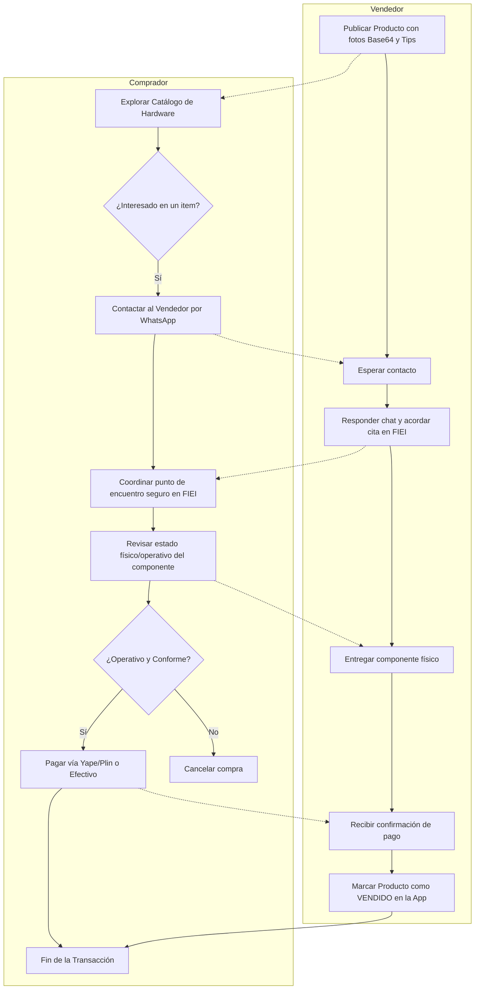
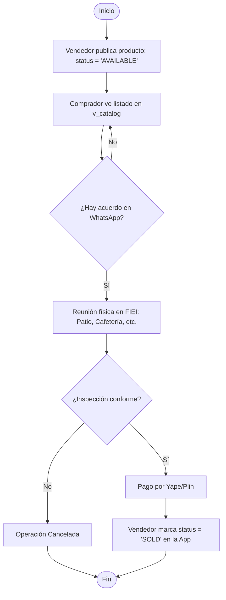
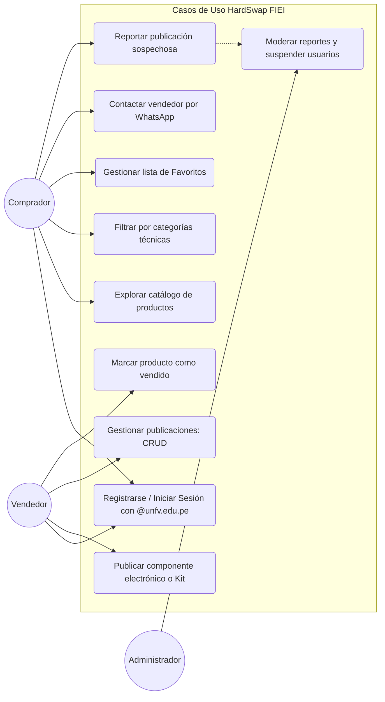
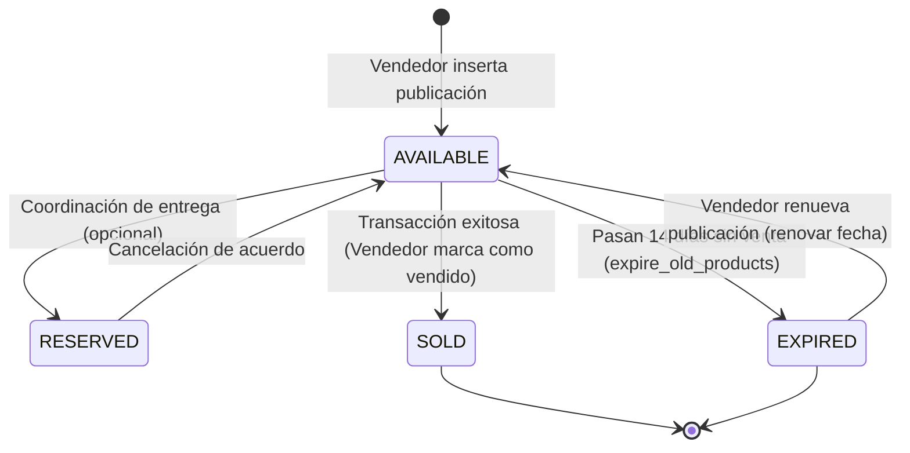
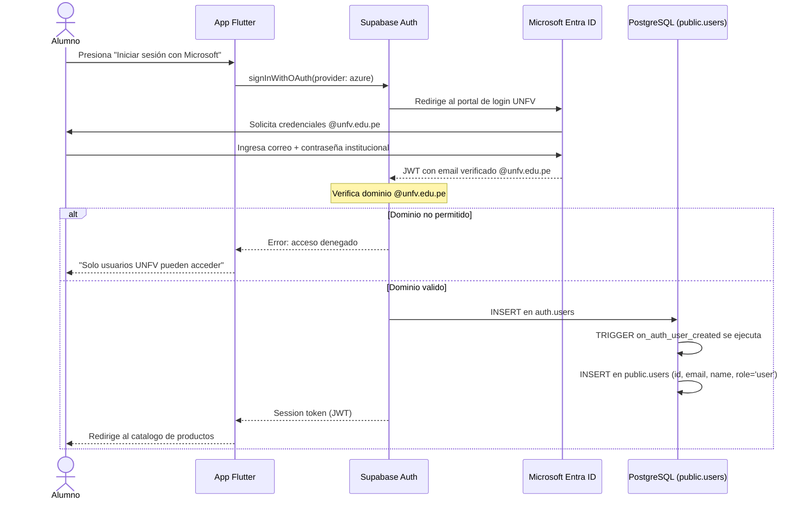
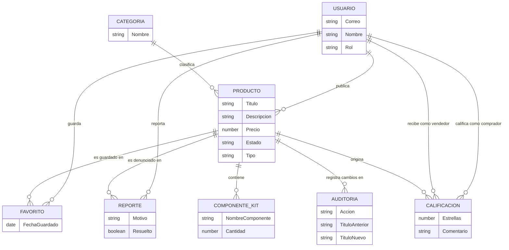
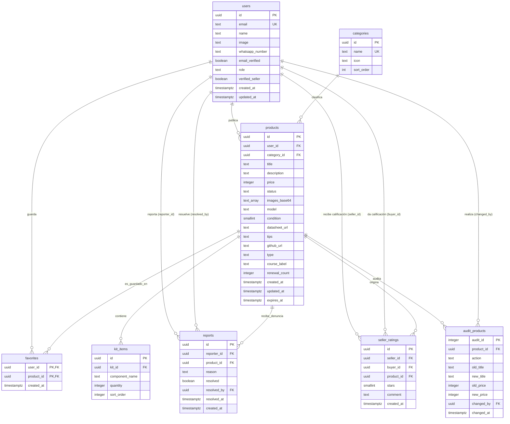

# 🎨 Guía de Diagramas y Modelamiento — HardSwap FIEI

Este archivo contiene el código de todos los diagramas requeridos en la **Sección 2.2 y 2.4** usando la sintaxis **Mermaid.js**. Puedes previsualizarlos en tu IDE o copiarlos y pegarlos en el [Mermaid Live Editor](https://mermaid.live) para exportarlos como imagen (PNG/SVG) o PDF para tu informe final.

---

## 🗺️ 1. Diagramas de Procesos (Sección 2.2)

### 1.1 Diagrama de Procesos (BPMN / Swimlanes simplificado)
Este diagrama muestra la interacción y los flujos de tareas entre el Comprador y el Vendedor durante el ciclo de compraventa.

---

### 1.2 Diagrama de Flujo de Transacciones
Muestra las etapas lógicas de una publicación desde su creación hasta su cierre.

---

### 1.3 Diagrama de Casos de Uso
Define el alcance de las acciones de cada actor (Comprador, Vendedor y Moderador/Administrador) en el sistema.

---

### 1.4 Diagrama de Actividades (Ciclo de Vida de una Publicación)
Muestra cómo evoluciona el estado del producto en base a disparadores manuales y automáticos.

---

### 1.5 Diagrama de Secuencia — Autenticación Institucional (OAuth)
Muestra el flujo completo de inicio de sesión con Microsoft Entra ID, restricción al dominio `@unfv.edu.pe` y sincronización automática con la base de datos vía trigger.

---

## 🗄️ 2. Modelado de Base de Datos (Sección 2.4)

### 2.0 Modelo Conceptual
Representa las entidades del negocio y sus relaciones desde una perspectiva abstracta, sin detalles técnicos de implementación.

---

### 2.1 Modelo Lógico (Diagrama Entidad-Relación - ERD)
Este diagrama representa las relaciones y campos estructurales configurados en la base de datos PostgreSQL de Supabase.

---

## 📱 3. Manual Básico de Usuario (Sección 6 — Entregables)

> Este manual describe cómo usar la app **La Cachina FIEI** desde el punto de vista de un estudiante.

### 3.1 Cómo registrarse
1. Abre la app en tu Android o en el navegador web.
2. Presiona el botón **"Iniciar sesión con Microsoft"**.
3. Ingresa tu correo institucional `@unfv.edu.pe` y contraseña.
4. Si tu cuenta es válida, se crea automáticamente tu perfil y entras al catálogo.

> **Importante:** Solo funcionan correos `@unfv.edu.pe`. Cuentas personales (Gmail, Hotmail) son rechazadas por el sistema.

### 3.2 Cómo comprar un componente
1. En la pantalla de **Catálogo**, usa la barra de búsqueda o los filtros de categoría para encontrar el componente que necesitas.
2. Toca la tarjeta del producto para ver los detalles: fotos, condición del componente (escala 1-10), datasheet, tips del vendedor.
3. Presiona el botón verde de **WhatsApp** para contactar directamente al vendedor con un mensaje preconfigurado.
4. Coordina el punto de entrega dentro del campus FIEI.
5. Revisa físicamente el componente antes de pagar.
6. Una vez recibido el componente, ve al detalle del producto y presiona **"Calificar vendedor"** para dejar tu opinión (1-5 estrellas).

### 3.3 Cómo vender un componente
1. Toca el ícono **"+"** en la barra de navegación inferior.
2. Rellena el formulario: título, categoría, descripción, precio (en soles), condición (1-10), modelo y photos del componente.
3. Opcionalmente, agrega el enlace al **Datasheet** y **Tips de conexión** para aumentar la confianza del comprador.
4. Presiona **"Publicar"** — el componente aparecerá en el catálogo para todos los estudiantes.
5. Cuando concretes la venta, busca tu publicación en **"Mis publicaciones"** y presiona **"Marcar como vendido"**.

> **Nota:** Las publicaciones expiran automáticamente a los **14 días** si no se marcan como vendidas. Puedes renovarlas desde "Mis publicaciones".

### 3.4 Cómo crear un Kit educativo
1. En el formulario de publicación, selecciona el tipo **"Kit"**.
2. Indica el curso de la FIEI al que está orientado.
3. Agrega los componentes que incluye el kit uno por uno.
4. El kit aparecerá con una etiqueta especial en el catálogo.

### 3.5 Cómo reportar una publicación
1. En el detalle del producto, presiona el ícono de **bandera** (reporte).
2. Selecciona el motivo del reporte.
3. El administrador recibirá la denuncia y la revisará.

---

## 🛠️ Herramientas para Modelamiento y Generación de Diagramas

Para incorporar estos diagramas de la manera más profesional posible en tu documento final de Word o PDF, puedes utilizar los siguientes métodos:

### 1. Generador Automático de Supabase (Schema Visualizer)
Supabase cuenta con una herramienta nativa para visualizar el modelo físico de tu base de datos:
1. Ingresa a tu **Supabase Dashboard**.
2. Dirígete a la pestaña **Database** (icono de base de datos en la barra lateral izquierda).
3. Selecciona la opción **Schema Visualizer**.
4. Te mostrará un diagrama interactivo con tus tablas (`users`, `products`, etc.), sus columnas y líneas de relación de llaves foráneas. Puedes tomarle captura directamente para tu informe del **Modelo Físico**.

### 2. dbdiagram.io (Para Modelo Lógico / Entidad-Relación)
Si quieres un diagrama de base de datos editable y estético a partir de tu script SQL:
1. Entra a [dbdiagram.io](https://dbdiagram.io/).
2. Copia y pega las sentencias `CREATE TABLE` de tu archivo `schema_completo.sql`.
3. La herramienta procesará el código y te generará automáticamente un diagrama de tablas interactivo con sus relaciones, el cual puedes exportar como imagen o PDF.

### 3. Mermaid Live Editor (Para BPMN, Casos de Uso y Flujo)
Para editar o descargar los diagramas definidos arriba:
1. Abre [mermaid.live](https://mermaid.live).
2. Copia el bloque de código del diagrama que desees (sin las comillas triples de markdown).
3. Pégalo en el panel izquierdo (code editor).
4. En el panel inferior derecho, haz clic en **Actions** y selecciona **Download PNG** o **Download SVG** para guardarlo en alta resolución.

### 4. Camunda Modeler o Draw.io
- Si tu profesor es muy exigente con la notación formal de **BPMN 2.0** (usando compuertas exclusivas, eventos de tiempo, subprocesos, etc.), te recomiendo importar o dibujar el proceso en [draw.io](https://app.diagrams.net/) (que tiene formas específicas para BPMN) o descargar [Camunda Modeler](https://camunda.com/download/modeler/) que es el estándar de modelado de procesos de negocio.
